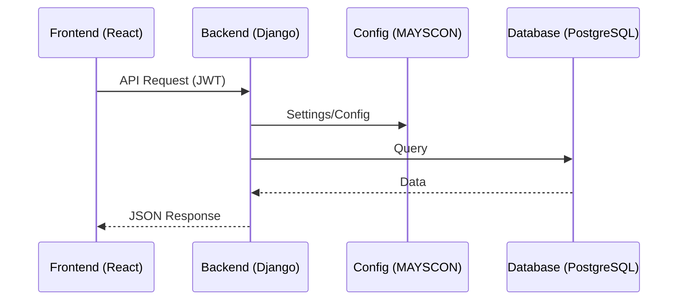

# 📚 BelgeNet - Kapsamlı Proje Analiz Raporu

**Tarih:** 1 Ocak 2026  
**Versiyon:** 1.0  
**Hazırlayan:** AI Analiz Sistemi

---

## 📋 Yönetici Özeti

**BelgeNet**, çok kiracılı (multi-tenant), rol tabanlı ve yapay zeka destekli bir **Eğitim Yönetim Sistemi (LMS)** platformudur. Proje iki ana bileşenden oluşur:

1. **AKADEMI** - LMS portali (Django backend + React frontend)
2. **MAYSCON** - Merkezi Ayar Yönetim Sistemi (Central Configuration Management)

### Projenin Temel İşlevi

BelgeNet, eğitim kurumlarının (üniversiteler, belediyeler, şirketler) kendi **özel eğitim portallarını** yönetmelerini sağlar:

- 🎓 **Öğrenciler:** Video dersler izleyebilir, quizlere katılabilir, canlı derslere bağlanabilir
- 👨‍🏫 **Eğitmenler:** Kurs oluşturabilir, AI ile quiz üretebilir, öğrenci takibi yapabilir
- 🏛️ **Akademi Yöneticileri:** Kullanıcı ve kurs yönetimi, raporlama
- ⚡ **Süper Admin:** Platform genelinde akademi ve kaynak yönetimi

---

## 🗂️ Genel Proje Yapısı

```
BelgeNet/
├── docs/                    # Dokümantasyon (23 dosya)
│
└── v0/                      # Versiyon 0
    ├── AKADEMI/             # 🎓 LMS Portal
    │   ├── akademi/         # Django proje ayarları
    │   ├── backend/         # 22 Django uygulaması
    │   ├── frontend/        # React + Vite + TypeScript
    │   └── manage.py
    │
    └── MAYSCON/             # ⚙️ Merkezi Yönetim
        └── mayscon.v1/      # config, infra, logs, tools, webapp
```

---

# 🔧 BÖLÜM 1: BACKEND ANALİZİ

## 1.1 Genel Bakış

Backend, **Django REST Framework** üzerine kurulu olup **22 modüler uygulama** içermektedir.

### Teknoloji Stack
| Teknoloji | Versiyon | Kullanım |
|-----------|----------|----------|
| Python | 3.11+ | Ana dil |
| Django | 5.2+ | Web framework |
| DRF | 3.14+ | REST API |
| PostgreSQL | 16 | Veritabanı |
| JWT | - | Authentication |
| Celery | - | Async tasks |

---

## 1.2 Modül Detayları

### A. Temel Modüller (Core)

#### `users/` - Kullanıcı Yönetimi
**Amaç:** Kullanıcı kimlik doğrulama ve yetkilendirme

| API Endpoint | Method | Açıklama |
|--------------|--------|----------|
| `/api/v1/auth/token/` | POST | JWT token al (login) |
| `/api/v1/auth/register/` | POST | Yeni kullanıcı kaydı |
| `/api/v1/auth/me/` | GET/PATCH | Mevcut kullanıcı bilgileri |
| `/api/v1/auth/password/change/` | POST | Şifre değiştir |
| `/api/v1/auth/logout/` | POST | Çıkış yap |
| `/api/v1/users/` | GET/POST | Kullanıcı CRUD (Admin) |
| `/api/v1/users/students/` | GET | Öğrenci listesi |
| `/api/v1/users/instructors/` | GET | Eğitmen listesi |

**Roller:**
- `STUDENT` - Öğrenci
- `INSTRUCTOR` - Eğitmen
- `TENANT_ADMIN` - Akademi Yöneticisi
- `SUPER_ADMIN` - Platform Yöneticisi

---

#### `tenants/` - Çoklu Kurum (Multi-Tenancy)
**Amaç:** Farklı kurumların tek platform üzerinde izole çalışması

```python
# Tenant model yapısı
class Tenant:
    name: str           # "İBB Teknoloji Akademisi"
    slug: str           # "ibb-tech"
    type: str           # Municipality, University, Corporate
    logo: str
    config: {
        primaryColor: str,
        modules: {
            liveClass: bool,
            quiz: bool,
            exam: bool,
            assignment: bool
        },
        storageLimit: int  # GB
    }
```

---

#### `libs/` - Paylaşılan Kütüphaneler
**Amaç:** Tüm uygulamalar arasında paylaşılan utility fonksiyonları

- Permission sınıfları (`IsInstructorOrAdmin`, vb.)
- Pagination sınıfları
- Mixins ve base serializer'lar

---

### B. LMS Modülleri

#### `courses/` - Kurs Yönetimi
**Amaç:** Kurs oluşturma, modül ve içerik yönetimi

| API Endpoint | Method | Açıklama |
|--------------|--------|----------|
| `/api/v1/courses/` | GET/POST | Kurs listele/oluştur |
| `/api/v1/courses/{slug}/` | GET/PUT/DELETE | Kurs detay/güncelle/sil |
| `/api/v1/courses/{slug}/enroll/` | POST | Kursa kayıt ol |
| `/api/v1/courses/{slug}/submit_for_review/` | POST | Kursu onaya gönder |
| `/api/v1/courses/{slug}/approve/` | POST | Kursu onayla |
| `/api/v1/modules/` | CRUD | Modül yönetimi |
| `/api/v1/contents/` | CRUD | İçerik yönetimi |
| `/api/v1/enrollments/` | CRUD | Kayıt yönetimi |

**Kurs Durumları:**
```
Draft → Pending → Published/Rejected → Archived
```

**İçerik Türleri:**
- VIDEO, DOCUMENT, QUIZ, ASSIGNMENT, EXAM, LIVE

---

#### `student/` - Öğrenci API'leri
**Amaç:** Öğrenci dashboard ve aktivite API'leri

- Dashboard verileri
- Kayıtlı kurslar
- Takvim ve ödevler

---

#### `instructor/` - Eğitmen API'leri
**Amaç:** Eğitmen dashboard ve yönetim API'leri

- Dashboard verileri
- Kendi kursları
- Öğrenci takibi
- Değerlendirme yönetimi

---

### C. Player Modülleri

#### `player/` - Video Oynatıcı
**Amaç:** Video içerik playback yönetimi

- Playback session'ları
- Video kalite ayarları
- Altyazı desteği

---

#### `progress/` - İlerleme Takibi
**Amaç:** Öğrenci ders tamamlama takibi

```python
# Progress model
class ContentProgress:
    user: User
    content: Content
    progress_percent: int  # 0-100
    completed: bool
    last_position: int     # Video saniye
    completed_at: datetime
```

---

#### `telemetry/` - Event Tracking
**Amaç:** Kullanıcı davranış analizi

- Video izleme olayları (play, pause, seek)
- Quiz etkileşimleri
- Sayfa geçişleri

---

#### `sequencing/` - İçerik Kilitleme
**Amaç:** İçeriklerin sıralı açılması

```python
# Kilitleme kuralları
- Önceki içerik tamamlanmadan sonraki açılmaz
- Quiz geçme notu tutturulmadan devam edilmez
```

---

#### `timeline/` - Overlay Nodes
**Amaç:** Video üzerinde interaktif elementler

- Quiz pop-up'ları
- Bilgi kartları
- Kaynak linkleri

---

#### `notes/` - Video Notları
**Amaç:** Öğrencinin video izlerken not alması

- Zaman damgalı notlar
- Not paylaşımı (opsiyonel)

---

### D. Değerlendirme Modülleri

#### `quizzes/` - Quiz Sistemi
**Amaç:** Quiz/sınav oluşturma ve değerlendirme

**Soru Türleri:**
- Çoktan seçmeli
- Doğru/Yanlış
- Boşluk doldurma
- Eşleştirme

**Özellikler:**
- Otomatik puanlama
- Zaman sınırı
- Karıştırma seçenekleri

---

#### `certificates/` - Sertifika Sistemi
**Amaç:** Kurs tamamlama sertifikaları

- Dinamik sertifika şablonları
- QR kod doğrulama
- PDF indirme

---

### E. AI ve Öneri Modülleri

#### `ai/` - Yapay Zeka Özellikleri
**Amaç:** AI destekli eğitim araçları

**Servisler:**
| Servis | Açıklama |
|--------|----------|
| Quiz Generator | Doküman/video'dan otomatik soru üretimi |
| Content Summarizer | İçerik özeti oluşturma |
| Recommendation Engine | Kişiselleştirilmiş kurs önerileri |

```python
# AI Quiz Generation örneği
POST /api/v1/ai/generate-quiz/
{
    "source_type": "document",
    "source_id": "doc_123",
    "question_count": 10,
    "difficulty": "medium"
}
```

---

#### `recommendations/` - Öneri Sistemi
**Amaç:** Öğrenciye kişiselleştirilmiş içerik önerileri

- İzleme geçmişine dayalı öneriler
- Benzer öğrenci davranış analizi
- Popüler içerik önerileri

---

### F. Canlı Ders Modülleri

#### `live/` - Canlı Ders Sistemi
**Amaç:** Video konferans entegrasyonu

**Desteklenen Providerlar:**
| Provider | Açıklama |
|----------|----------|
| BigBlueButton (BBB) | Açık kaynak, self-hosted |
| Zoom | Zoom Meeting API |
| Google Meet | Google Calendar entegrasyonu |

**Özellikler:**
- Ders planlama
- Katılım takibi
- Kayıt (recording)
- Chat ve Q&A

---

#### `realtime/` - Gerçek Zamanlı İletişim
**Amaç:** WebSocket tabanlı anlık iletişim

- Canlı bildirimler
- Chat mesajları
- Presence (online durumu)

---

### G. Altyapı Modülleri

#### `storage/` - Dosya Yönetimi
**Amaç:** Dosya yükleme ve depolama

- Video upload (büyük dosyalar için chunked upload)
- Doküman yönetimi
- S3/MinIO entegrasyonu

---

#### `integrity/` - Güvenlik/Anti-Cheat
**Amaç:** Sınav güvenliği

**Özellikler:**
- Secure mode (tam ekran zorunluluğu)
- Tab değişikliği algılama
- Copy-paste engelleme
- Webcam proctoring (planlanan)

---

## 1.3 Backend API Özeti

| Kategori | Endpoint Sayısı |
|----------|-----------------|
| Authentication | ~8 |
| Users | ~10 |
| Courses | ~15 |
| Player/Progress | ~12 |
| Quizzes | ~10 |
| AI | ~5 |
| Live | ~8 |
| **Toplam** | **~70+** |

---

# 🎨 BÖLÜM 2: FRONTEND ANALİZİ

## 2.1 Genel Bakış

Frontend, **modern SPA (Single Page Application)** mimarisi ile geliştirilmiştir.

### Teknoloji Stack
| Teknoloji | Açıklama |
|-----------|----------|
| React 18+ | UI framework |
| TypeScript | Type-safe JavaScript |
| Vite | Build tool (hızlı dev server) |
| Tailwind CSS | Utility-first CSS |
| React Router v6+ | Client-side routing |
| Lucide React | Icon kütüphanesi |
| Recharts | Chart kütüphanesi |
| Context API | State management |

---

## 2.2 Dizin Yapısı

```
frontend/
├── components/          # 13 paylaşılan UI bileşeni
│   ├── ui/              # Button, Card, Input vb.
│   ├── layout/          # Sidebar, Header
│   └── shared/          # Kompleks ortak bileşenler
│
├── contexts/            # 2 context
│   ├── AuthContext      # Kullanıcı oturumu
│   └── TenantContext    # Aktif akademi
│
├── features/            # 65 feature
│   ├── admin/           # Yönetici modülü (16 sayfa)
│   ├── lms/             # LMS modülü (30 sayfa)
│   │   ├── instructor/  # Eğitmen (14 sayfa)
│   │   └── student/     # Öğrenci (13 sayfa)
│   └── core/            # Temel sayfalar (4)
│
├── hooks/               # 3 custom hook
│   ├── useAuth          # Authentication
│   ├── useDebounce      # Input debouncing
│   └── ...
│
├── lib/                 # 12 utility
│   ├── api.ts           # API client
│   ├── constants.ts     # Sabit değerler
│   └── utils.ts         # Helper fonksiyonlar
│
├── types/               # TypeScript interfaces
│
├── App.tsx              # Ana routing
└── index.tsx            # Entry point
```

---

## 2.3 Öğrenci Modülü (Student)

### Dashboard (Panel)
- **Yaklaşan Canlı Dersler:** Yatay scroll ile en yakın 3 ders
- **Son İzlenenler:** Son erişilen video içerikleri
- **Görevler:** Teslim tarihi yaklaşan ödevler
- **İlerleme Grafiği:** Haftalık ders tamamlama (Recharts)

### Eğitimlerim (My Courses)
- Grid yapısında kayıtlı kurslar
- Kategori ve ilerleme filtresi
- Kurs kartı → CoursePlayer

### Canlı Dersler
- Hero section: Sayaç (countdown)
- Tarihsel ders listesi
- Katılım akışı: Katıl → Onay → Meeting link

### Ödevler
- Durum: Bekleyen, Tamamlanan, Onaylanan/Reddedilen
- Dosya yükleme (PDF, ZIP)
- Eğitmen geri bildirimi

### Sınavlar & Quizler
- Tarihsel sıralı kartlar
- Secure mode uyarıları

---

## 2.4 Eğitmen Modülü (Instructor)

### Dashboard
- Canlı yayın takvimi
- Hızlı işlem drawer'ı
- Son öğrenci teslimleri

### Eğitim Yönetimi (Course Wizard)
**4 Adımlı Sihirbaz:**
1. **Temel Bilgiler:** Başlık, kategori, görsel
2. **Müfredat:** Hafta/modül yapısı, içerik ekleme
3. **Ayarlar:** Fiyat, sertifika, geçme notu
4. **Önizleme & Yayınla:** Tenant Admin onayına gönder

### İçerik Araçları
- **Canlı Ders Planlama:** Tarih, saat, meeting link
- **Ödev Yöneticisi:** Filtreleme, indirme, notlandırma
- **Quiz Oluşturucu:** Manuel + AI destekli soru üretimi

### Öğrenci Takibi
- Ders bazlı başarı grafikleri
- Riskli öğrenci listesi (düşük not/devamsız)

---

## 2.5 Yönetici Modülü (Admin)

### Tenant Admin Özellikleri
| Sayfa | Açıklama |
|-------|----------|
| Kullanıcı Yönetimi | Öğrenci/eğitmen listesi, rol değiştirme |
| Kurs Onay | Pending kursları incele, onayla/reddet |
| Raporlar | Eğitmen performans, başarı oranları |
| Ayarlar | Tema, sidebar, font ayarları |

### Super Admin Özellikleri
| Sayfa | Açıklama |
|-------|----------|
| Dashboard | Cloud kaynakları, finans özeti |
| Akademi Yönetimi | Yeni akademi, limitler, yönetici atama |
| Global Kullanıcılar | Tüm kullanıcı arama, şifre sıfırlama |
| Finans | Akademi ciro, eğitmen hakediş |

---

## 2.6 Önemli Bileşenler

### CoursePlayer.tsx (33KB)
Ana video oynatıcı bileşeni:
- Video playback
- Progress tracking
- Timeline overlays
- Notes panel
- Quiz entegrasyonu

### DashboardStudent.tsx / DashboardInstructor.tsx
Rol bazlı dashboard bileşenleri:
- Widget'lar
- Grafikler
- Hızlı aksiyonlar

---

# ⚙️ BÖLÜM 3: MAYSCON ANALİZİ

## 3.1 Genel Bakış

**MAYSCON** (Merkezi Ayar Yönetim Sistemi CONfiguration), BelgeNet ekosisteminin **altyapı omurgasıdır**. Tüm projeler (AKADEMI, gelecekte eklenecek diğer servisler) bu merkezi sistemden ayarlarını alır.

### Vizyon

```
┌─────────────────────────────────────────┐
│          EDUTECH PLATFORM               │
│    (E-ticaret, Pazarlama, Sosyal)       │
└─────────────────────────────────────────┘
                    │
                    ▼
┌─────────────────────────────────────────┐
│          AKADEMI PORTAL (LMS)           │
│    (Learning Management System)         │
└─────────────────────────────────────────┘
                    │
                    ▼
┌─────────────────────────────────────────┐
│          MAYSCON CORE                   │
│    Config | Infra | Logs | Tools        │
└─────────────────────────────────────────┘
```

---

## 3.2 Config (Merkezi Konfigürasyon)

### 3.2.1 Settings Modülleri (18 dosya)

| Dosya | Açıklama |
|-------|----------|
| `base.py` | Temel Django ayarları |
| `security.py` | Güvenlik (CSRF, XSS, HSTS) |
| `auth.py` | Authentication ayarları |
| `jwt.py` | JWT token konfigürasyonu |
| `cors.py` | CORS ayarları |
| `cache.py` | Redis cache |
| `data/` | Database konfigürasyonu |
| `logging/` | Log konfigürasyonu |
| `middleware.py` | Middleware sırası |
| `static.py` | Static/Media dosyaları |
| `templates.py` | Template engine |
| `rest.py` | DRF ayarları |
| `i18n.py` | Internationalization |
| `dev.py` | Development overrides |
| `prod.py` | Production overrides |

### 3.2.2 AKADEMI Kalıtımı

```python
# akademi/settings.py
from config.settings import *  # MAYSCON'dan tüm ayarları al

# Akademi'ye özel eklemeler
INSTALLED_APPS += [
    'backend.users',
    'backend.courses',
    # ...
]
```

---

## 3.3 Infra (Altyapı)

### 3.3.1 Docker Yapısı

| Dosya | Kullanım |
|-------|----------|
| `docker-compose.yml` | Temel compose |
| `docker-compose.dev.yml` | Development ortamı |
| `docker-compose.prod.yml` | Production ortamı |
| `docker-compose.akademi.yml` | AKADEMI'ye özel |
| `Dockerfile.dev` | Dev image |
| `Dockerfile.prod` | Prod image |

### 3.3.2 Çalışan Servisler (Docker)

> [!NOTE]
> Proje Docker üzerinde çalışmaktadır. AKADEMI, ayarlarını MAYSCON merkezi sisteminden kalıtım yoluyla alır.

| Servis | URL/Port | Durum |
|--------|----------|-------|
| **Frontend** | http://localhost:3000 | ✅ Çalışıyor |
| **Backend** | http://localhost:8000 | ✅ Çalışıyor |
| PostgreSQL Primary | localhost:5440 | ✅ Healthy |
| PostgreSQL Analytics | localhost:5441 | ✅ Healthy |
| PostgreSQL Logs | localhost:5442 | ✅ Healthy |
| PostgreSQL Media | localhost:5443 | ✅ Healthy |

### 3.3.3 Multi-Database Desteği

```python
DATABASES = {
    'default': {...},      # Primary
    'replica': {...},      # Read replica
    'analytics': {...},    # Analytics veri
    'logs': {...},         # Log verisi
}
```

---

## 3.4 Logs (Log Yönetimi)

### 3.4.1 Log Uygulamaları

| App | Açıklama |
|-----|----------|
| `analytics/` | Log metrikleri ve dashboard |
| `audit/` | Kullanıcı aktivite logları |
| `viewer/` | Web tabanlı log görüntüleyici |

### 3.4.2 Log Dosya Yapısı

```
logs/data/
├── global.log          # Tüm önemli loglar (INFO+)
├── access.log          # HTTP access logları
├── levels/
│   ├── debug.log       # DEBUG seviyesi
│   ├── info.log        # INFO seviyesi
│   ├── warning.log     # WARNING seviyesi
│   └── error.log       # ERROR+ seviyesi
├── database/
│   └── sql.log         # SQL sorguları
└── archive/            # Arşivlenmiş loglar
```

---

## 3.5 Tools (Araçlar)

### 3.5.1 Database Routers

```python
# tools/db/routers/akademi.py
class AkademiRouter:
    """AKADEMI modelleri için routing"""
    
    def db_for_read(self, model, **hints):
        if model._meta.app_label in ['courses', 'users']:
            return 'default'  # veya 'replica'

    def db_for_write(self, model, **hints):
        if model._meta.app_label in ['courses', 'users']:
            return 'default'
```

### 3.5.2 Management Commands

Özel Django yönetim komutları:
- Database backup/restore
- Log rotation
- Cache temizleme

### 3.5.3 Monitor Sistemi

- **Terminal Monitor:** Rich UI ile canlı log izleme
- **Web Dashboard:** FastAPI tabanlı (port 9000)
- **Live Request Monitor:** HTTP request takibi

### 3.5.4 Requirements Yönetimi

```
tools/requirements/
├── base.txt      # Temel bağımlılıklar
├── api.txt       # API bağımlılıkları
├── data.txt      # Database bağımlılıkları
├── dev.txt       # Development bağımlılıkları
├── prod.txt      # Production bağımlılıkları
└── full.txt      # Tüm bağımlılıklar
```

---

## 3.6 Webapp (Web Uygulaması)

MAYSCON'un kendi web arayüzü:

| Dizin | Açıklama |
|-------|----------|
| `core/` | Core Django app |
| `home/` | Ana sayfa |
| `static/` | Merkezi static dosyalar |
| `media/` | Merkezi media dosyalar |
| `templates/` | Merkezi HTML templates |

---

# 🔗 BÖLÜM 4: EKOSISTEM ENTEGRASYONU

## 4.1 AKADEMI ↔ MAYSCON İlişkisi

```
AKADEMI/
├── akademi/settings.py → MAYSCON/config/settings/ (kalıtım)
├── akademi/urls.py → MAYSCON/config/urls/ (extend)
└── logs/ → MAYSCON/logs/data/akademi/ (merkezi log)
```

## 4.2 Veri Akışı



---

# 📊 BÖLÜM 5: ÖZET VE METRİKLER

## 5.1 Proje Metrikleri

| Metrik | Değer |
|--------|-------|
| Backend App Sayısı | 22 |
| Frontend Sayfa Sayısı | ~65 |
| API Endpoint Sayısı | ~70+ |
| Settings Modülü | 18 |
| Desteklenen Roller | 4 |
| Desteklenen Diller | TR, EN |

## 5.2 Projenin Temel Yetenekleri

| Özellik | Durum |
|---------|-------|
| Multi-tenancy | ✅ |
| JWT Authentication | ✅ |
| Video Oynatıcı | ✅ |
| İlerleme Takibi | ✅ |
| Quiz Sistemi | ✅ |
| AI Quiz Generation | ✅ |
| Canlı Ders (BBB/Zoom/Meet) | ✅ |
| Sertifika Sistemi | ✅ |
| Öneri Sistemi | ✅ |
| Anti-Cheat | ✅ |

## 5.3 Sonuç

**BelgeNet**, modern bir LMS platformu olarak tasarlanmıştır:

1. **Modüler Mimari:** MAYSCON merkezi yönetim + AKADEMI LMS ayrımı
2. **Ölçeklenebilir:** Multi-tenant yapı ile sınırsız akademi
3. **Modern Tech Stack:** Django 5.2 + React 18 + TypeScript
4. **AI Entegrasyonu:** Akıllı quiz üretimi ve kişisel öneriler
5. **DevOps Ready:** Docker, monitoring, logging altyapısı

---

# 📁 BÖLÜM 6: DOKÜMANTASYON İNDEKSİ

Bu bölüm, `docs/` klasöründeki tüm dokümantasyon dosyalarını kategorize eder.

## 6.1 Ana Dokümantasyon Dosyaları

| Dosya | Boyut | Açıklama |
|-------|-------|----------|
| [TODO.md](file:///Users/esat/Desktop/belgenet%20hatal%C4%B1/BelgeNet/docs/TODO.md) | 25KB | Merkezi iş programı, modül ilerleme durumu (%81 tamamlandı) |
| [BELGE_NET_MIMARI_ANALIZ_V3.md](file:///Users/esat/Desktop/belgenet%20hatal%C4%B1/BelgeNet/docs/BELGE_NET_MIMARI_ANALIZ_V3.md) | 23KB | Ekosistem mimari analiz raporu v3 |
| [PROJE_ANALIZ_RAPORU.md](file:///Users/esat/Desktop/belgenet%20hatal%C4%B1/BelgeNet/docs/PROJE_ANALIZ_RAPORU.md) | 23KB | Proje analiz raporu v1 |
| [PROJE_ANALIZ_RAPORU_V2.md](file:///Users/esat/Desktop/belgenet%20hatal%C4%B1/BelgeNet/docs/PROJE_ANALIZ_RAPORU_V2.md) | 9KB | Proje analiz raporu v2 |

## 6.2 Modül TODO Dökümanları

| Dosya | Boyut | Açıklama |
|-------|-------|----------|
| [B6_CANLI_DERS_TODO.md](file:///Users/esat/Desktop/belgenet%20hatal%C4%B1/BelgeNet/docs/B6_CANLI_DERS_TODO.md) | 47KB | Canlı ders modülü detaylı spesifikasyonu (Provider adapter pattern, Jitsi/BBB/Zoom) |
| [COURSE_PLAYER_TODO.md](file:///Users/esat/Desktop/belgenet%20hatal%C4%B1/BelgeNet/docs/COURSE_PLAYER_TODO.md) | 19KB | Video oynatıcı entegrasyon planı (Phase 1 MVP tamamlandı) |
| [DJANGO_REACT_ENTEGRASYON_TODO.md](file:///Users/esat/Desktop/belgenet%20hatal%C4%B1/BelgeNet/docs/DJANGO_REACT_ENTEGRASYON_TODO.md) | 23KB | Django + React API entegrasyon analizi ve todo listesi |

## 6.3 Planlama ve Test Dökümanları

| Dosya | Boyut | Açıklama |
|-------|-------|----------|
| [IS_PROGRAMI_v1.md](file:///Users/esat/Desktop/belgenet%20hatal%C4%B1/BelgeNet/docs/IS_PROGRAMI_v1.md) | 5KB | Konsolidasyon iş programı (6 aşamalı) |
| [TEST_RAPORU_27_ARALIK_2024.md](file:///Users/esat/Desktop/belgenet%20hatal%C4%B1/BelgeNet/docs/TEST_RAPORU_27_ARALIK_2024.md) | 7KB | Sistem test raporu (77/79 test başarılı) |

---

## 6.4 Güncel Güncellemeler (new_updates/)

### Test Dökümanları

| Dosya | Boyut | Açıklama |
|-------|-------|----------|
| MASTER_TEST_PLAN.md | 44KB | Ana test planı |
| test_plan.md | 37KB | Detaylı test planı |
| test_results_report.md | 30KB | Test sonuçları raporu |
| test_summary.md | 10KB | Test özeti |
| test_setup_guide.md | 11KB | Test kurulum kılavuzu |

### Frontend Test Dökümanları

| Dosya | Boyut | Açıklama |
|-------|-------|----------|
| frontend_test_development_analysis.md | 17KB | Frontend test geliştirme analizi |
| frontend_test_implementation.md | 13KB | Frontend test implementasyonu |

### Proje Yönetim Dökümanları

| Dosya | Boyut | Açıklama |
|-------|-------|----------|
| change_log.md | 20KB | Değişiklik günlüğü |
| todo_list_v2.md | 18KB | Todo listesi v2 |
| todo_list_v3.md | 11KB | Todo listesi v3 |
| next_steps.md | 9KB | Sonraki adımlar |

### Teknik Dökümanlar

| Dosya | Boyut | Açıklama |
|-------|-------|----------|
| decision_table.md | 11KB | Karar tablosu |
| compatibility_checklist.md | 9KB | Uyumluluk kontrol listesi |
| skip_registry.md | 11KB | Atlanan testler kaydı |

---

## 6.5 Proje İlerleme Durumu (TODO.md'den)

### Tamamlanan Modüller (13/16 = %81)

| Modül | Durum |
|-------|-------|
| MAYSCON Altyapı | ✅ 100% |
| Backend Core | ✅ 100% |
| Student Modülü | ✅ 100% |
| Instructor Modülü | ✅ 100% |
| Admin Paneli | ✅ 100% |
| Course Player | ✅ 100% |
| Quiz Motoru | ✅ 100% |
| Dosya Sistemi | ✅ 100% |
| Sertifika | ✅ 100% |
| Bildirimler | ✅ 100% |
| Mesajlaşma | ✅ 100% |
| Canlı Ders | ✅ 100% |
| Frontend React | ✅ 100% |

### Bekleyen Modüller (3/16)

| Modül | Durum | Öncelik |
|-------|-------|---------|
| Ödeme Sistemi | 🔴 0% | Yüksek |
| Test & Kalite Güvencesi | 🔴 0% | Yüksek |
| Deployment & DevOps | 🔴 0% | Orta |

---

## 6.6 Sistem Test Sonuçları (27 Aralık 2024)

| Kategori | Başarılı | Toplam |
|----------|----------|--------|
| Dizin Yapısı | 18 | 18 |
| Environment Dosyaları | 7 | 7 |
| Kaldırılmış Dosyalar | 10 | 10 |
| Log Yapısı | 3 | 3 |
| Menu Yapısı | 6 | 6 |
| Test Yapısı | 6 | 6 |
| Requirements | 5 | 5 |
| Django Settings | 6 | 6 |
| Frontend Config | 2 | 2 |
| Backend Apps | 14 | 16 |
| **TOPLAM** | **77** | **79** |

> [!NOTE]
> 2 uyarı `backend.instructor` ve `backend.admin_api` için models.py olmadığına dair - bu normaldir, sadece view-only app'lerdir.

---

**Rapor Sonu**

*Bu rapor BelgeNet projesinin 1 Ocak 2026 tarihli durumunu yansıtmaktadır.*

